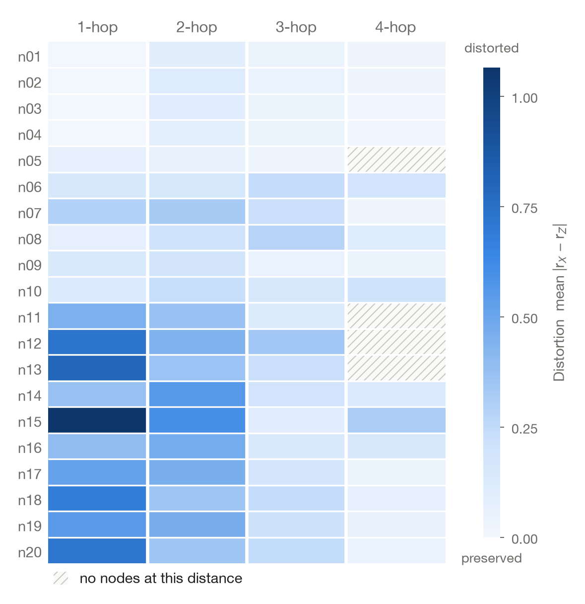

# tard

Topology–Attribute Relational Distortion (TARD) measures how learned node representations change relationships that existed between node attributes across graph-topological scales.

Given a graph $G=(V,E)$, original node attributes $X$ and learned representations $Z$ (for example graph embeddings or GNN outputs), `tard` compares, for every node and every hop distance $k$, how similar the node is to the nodes exactly $k$ hops away: once in attribute space and once in representation space.

<p align="center">
  
</p>

## Installation

From a clone of this repository:

```bash
uv sync
```

To use it from another uv project:

```bash
uv add /path/to/tard
```

The package depends only on NumPy, pandas, NetworkX and matplotlib, and requires Python 3.12 or newer.

## Quick start

Run from the repository root:

```python
import networkx as nx
import pandas as pd
import tard

edges = pd.read_csv("data/edges.csv")
attributes = pd.read_csv("data/attributes.csv", index_col="node")
embeddings = pd.read_csv("data/embeddings.csv", index_col="node")

graph = nx.from_pandas_edgelist(edges, "source", "target")

result = tard.compute(graph=graph, attributes=attributes, embeddings=embeddings, max_hops=4)

result.global_distortion
result.distortion
result.signed_change
```

`attributes` and `embeddings` are either DataFrames indexed by node ID, aligned to the graph by index, or NumPy arrays whose rows follow `graph.nodes` iteration order. Graphs must be undirected.

`result.distortion` and `result.signed_change` are node × hop DataFrames, so group and scale summaries are ordinary pandas operations, such as `result.distortion.mean(axis=0)`.

## Metric

Let $N_k(i)$ be the set of nodes exactly $k$ shortest-path hops from node $i$, and let $r_X(i,j)$ and $r_Z(i,j)$ be the cosine similarity of nodes $i$ and $j$ in $X$ and in $Z$.

$$
D_{i,k} = \frac{1}{|N_k(i)|} \sum_{j \in N_k(i)} \left| r_X(i,j) - r_Z(i,j) \right|
$$

$$
S_{i,k} = \frac{1}{|N_k(i)|} \sum_{j \in N_k(i)} \left( r_Z(i,j) - r_X(i,j) \right)
$$

- $D_{i,k}$, the distortion, is how much the similarity between $i$ and its $k$-hop nodes changed on average. Zero means those relationships are preserved.
- $S_{i,k}$, the signed change, is positive when those nodes became more similar in $Z$ and negative when they became less similar.
- $D_{\mathrm{global}}$ (`result.global_distortion`) is the mean of $D_{i,k}$ over all cells that have at least one node at distance $k$.

Cells with no nodes at distance $k$ are `NaN`, not zero. A zero vector has cosine similarity 0 with every vector.

Lower distortion means the measured topology–attribute relationships are more strongly preserved. It does not by itself mean a representation is better: whether preservation is desirable depends on what the representation is for.

## Visualization

```python
fig, ax = tard.plot_distortion_map(result)
fig, ax = tard.plot_signed_map(result)
fig, ax = tard.plot_node_profile(result, "n13")

fig.savefig("distortion.pdf")
```

The maps show nodes as rows and hop distances as columns. The distortion map uses a sequential scale from preserved to distorted. The signed map uses a diverging scale centered on zero, from less similar to more similar. Hatched cells have no nodes at that distance.

Every plotting function returns `fig, ax` and accepts an `ax` to draw into. To compare maps on one scale, pass the same `vmax` to `plot_distortion_map` or the same `limit` to `plot_signed_map`; values beyond it are marked by an arrow on the colorbar.

## Examples

- [`metric_explained.ipynb`](notebooks/metric_explained.ipynb): how one cell of the distortion map is calculated, by hand, on a seven-node graph.
- [`getting_started.ipynb`](notebooks/getting_started.ipynb): normal use of the library on the small dataset in `data/`.
- [`compare_embeddings.ipynb`](notebooks/compare_embeddings.ipynb): Laplacian Eigenmaps and DeepWalk compared by node classification and by topology–attribute distortion.
- [`case_study_elliptic_aml.ipynb`](notebooks/case_study_elliptic_aml.ipynb): real-world case study using Bitcoin anti-money-laundering detection to diagnose topology–attribute distortion around model successes and failures.

```bash
uv run jupyter lab notebooks/
```

The notebooks use the `notebooks` dependency group (Jupyter, scikit-learn, gensim), which `uv sync` installs by default. The case study additionally needs PyTorch and PyTorch Geometric, which are not installed by default:

```bash
uv sync --group case-study
```

On first run it downloads the Elliptic dataset (about 700 MB) into `data/elliptic/`, which Git ignores.

## Development

```bash
uv sync
uv run pytest
uv run ruff check .
uv run ruff format --check .
```

## License

MIT
